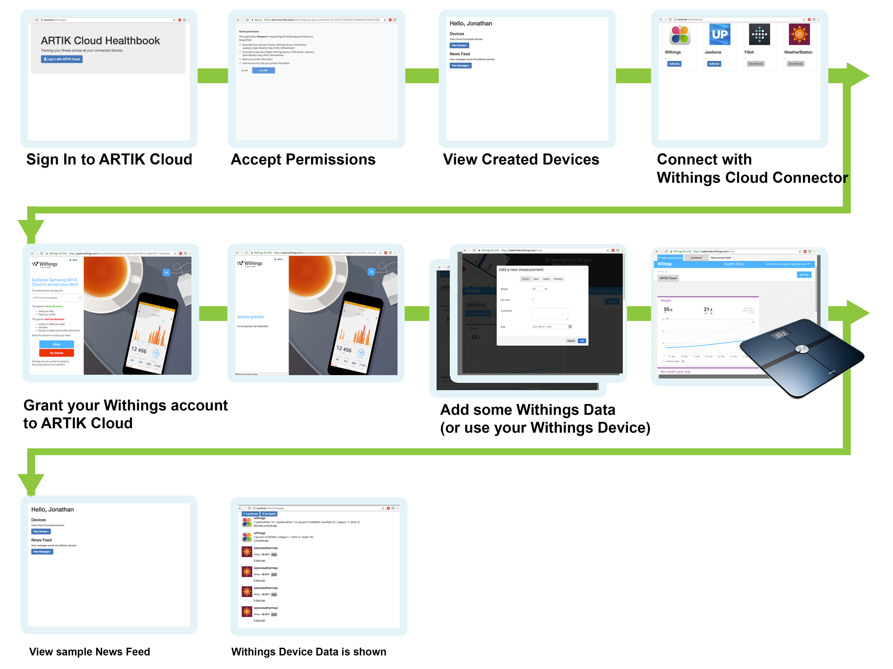

# Node.js web application sending and receiving data from ARTIK Cloud

A Node.js sample that connects to fitbit, withings and jawbone cloud connector to retrieve fitness data.

Running this sample will help you understand the following:

- Authenticating to 3rd party device api to retrieve device data.
- Receiving Messages from the 3rd party service 
- Adding an existing cloud connector to your web application

## Setup / Installation

### Setup at ARTIK Cloud

Follow [these instructions](https://developer.artik.cloud/documentation/tools/web-tools.html#creating-an-application) to create an application. 

- Under “AUTHORIZATION METHODS”, check “Authorization Code”.
- Set “Redirect URL” to http://localhost:4444/login/artikcloud/callback
- Under “PERMISSIONS”, check “Read” for “Profile”.

Click the “Add Device Type” button and be sure to enable “Read” and “Write” permissions for the following Device Types:

```json
Withings: dt29673f0481b4401bb73a622353b96150
Fitbit: dt8e71cabde68b4028b106832247cd6d72
Jawbone: dt548080e90be144f080ce28b26be62929
Openweathermap: dt9ad7ecfd34324765a9b12ef98a51b29e
```

Get the [Client ID & Client Secret](https://developer.artik.cloud/documentation/tools/web-tools.html#how-to-find-your-application-id), which you will need later.

### Setup at Code

Add your application client id / client secret to `config.json` file

```
{
  "address": "0.0.0.0",
  "port" : 4444,
  "debug" : true,
  "sessionSecret" : "not-so-very-secret",
  "oauth": {
    "clientID": "your-client-id",
    "clientSecret": "your-client-secret",
    "callbackURL": "http://localhost:4444/login/artikcloud/callback"
}

```

## Run Sample

```
%> npm install
%> ./bin/www
```

Browse to http://localhost:4444

## Demo / Screenshots

See larger screenshots with more details in the [screenshot folder](./screenshots)




More about ARTIK Cloud
---------------

If you are not familiar with ARTIK Cloud, we have extensive documentation at https://developer.artik.cloud/documentation

The full ARTIK Cloud API specification can be found at https://developer.artik.cloud/documentation/api-spec.html

Peek into advanced sample applications at https://developer.artik.cloud/documentation/samples/

To create and manage your services and devices on ARTIK Cloud, visit the Developer Dashboard at https://developer.artik.cloud


License and Copyright
---------------------

Licensed under the Apache License. See LICENSE.

Copyright (c) 2016 Samsung Electronics Co., Ltd.
