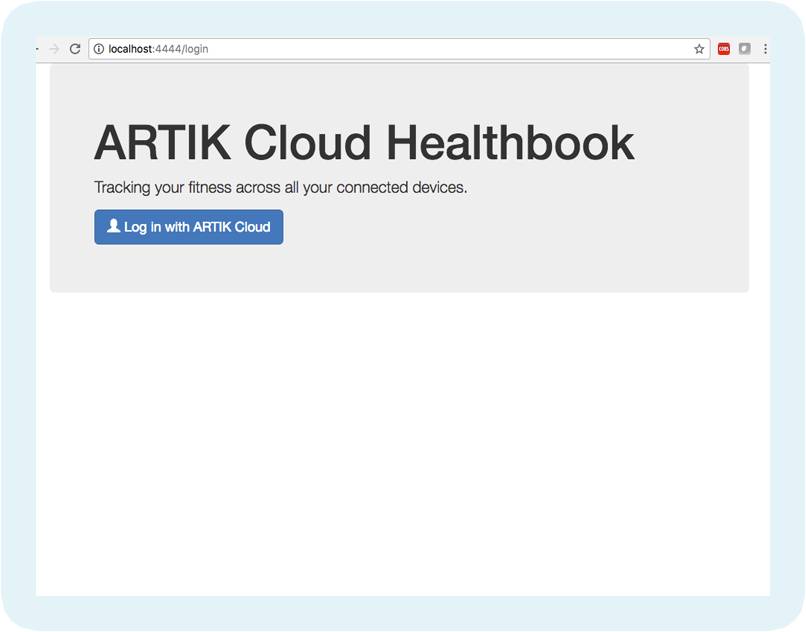
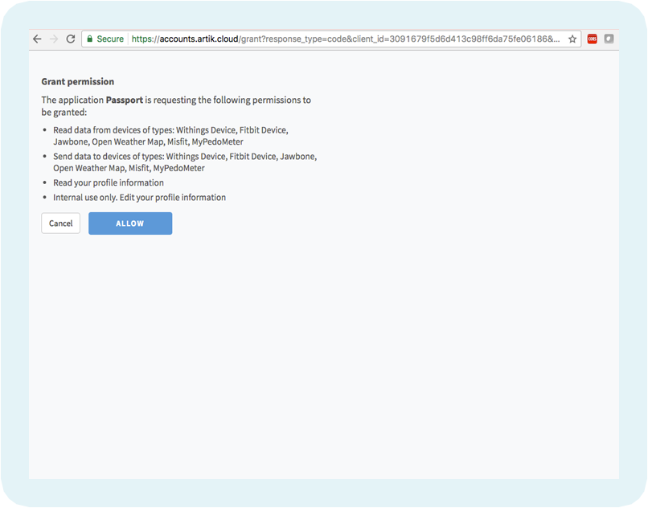
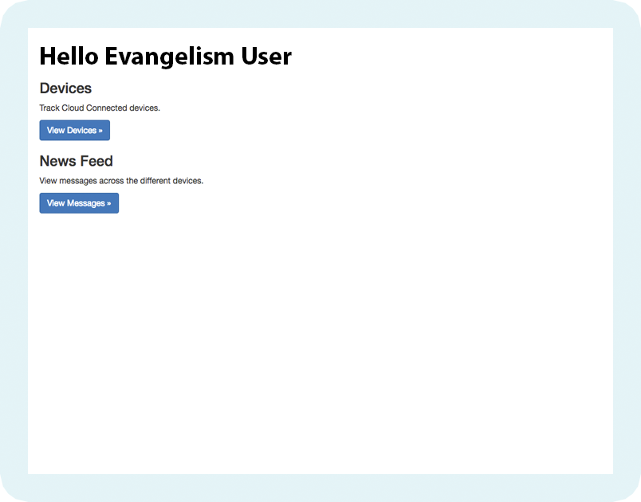
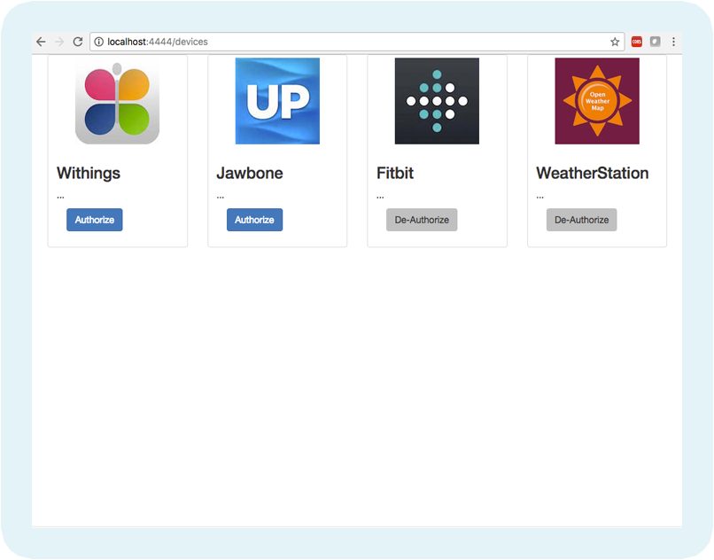
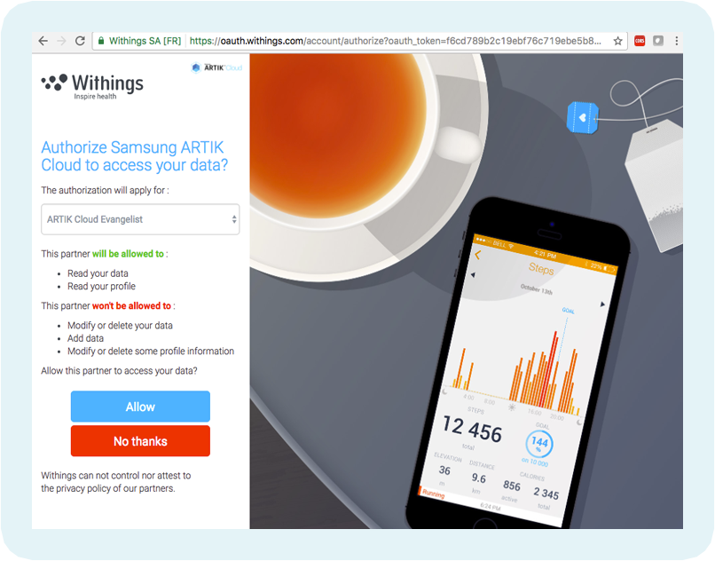
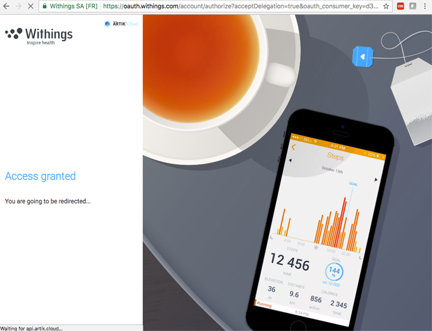
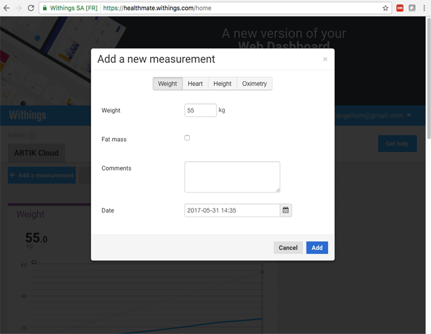
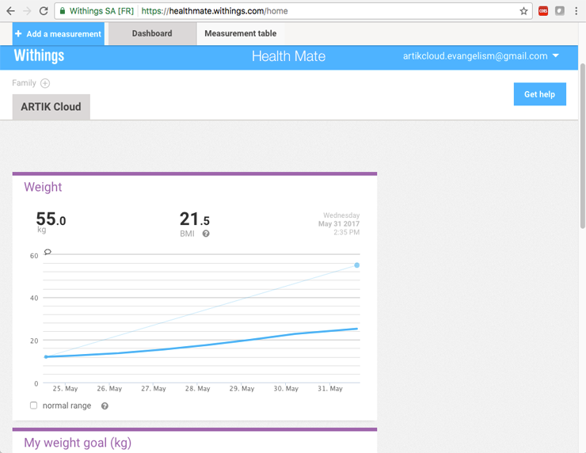
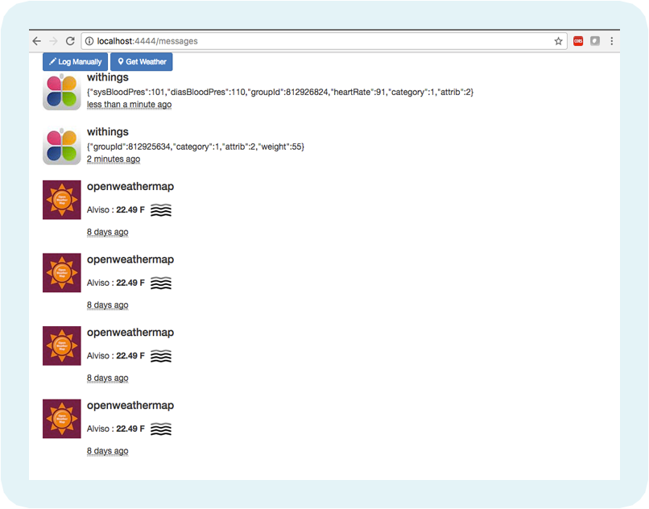

#Screenshots

#### Sign into your ARTIK Cloud account

#### Grant permission

- Review permissions screen.
- Grant your ARTIK Cloud account to the sample application to it can read / write and create devices listed

#### You are signed in and your name is displayed

- View Devices to Connect to another 3rd party cloud
- View Messages messages received from 3rd party cloud
  ​
  

#### View Devices

These are sample devices created into your account.  
- *Authorize* the 3rd party service with ARTIK Cloud
- Here we'll authorize with Withings
  

#### Authorize Withings Account to ARTIK Cloud

- Review permissions you are granting
- Grant permissions from Withings to ARTIK Cloud

####   

  

#### Add Withing Data

- Add new data from Withings website
- Or record new measurement with physical Withings Device

  

#### Recorded data as shown at Withings

  

#### View Messages with the Sample App

####   

#### View Messages Received

- View Messages received from 3rd party cloud

- Click on Get Weather to retrieve some weather data

    

